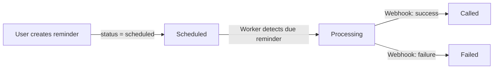

# Voice Reminder Service - Requirements Documentation

## 1. Overview

A Voice Reminder Service that allows users to schedule voice reminders executed via an external Voice Provider API (VAPI-like). The system triggers calls at scheduled times and processes webhook callbacks indicating call success or failure.

## 2. Application Description

### 2.1 Core Use Case

- Users sign up and create voice reminders
- Each reminder contains: phone number, message, scheduled date/time
- System creates voice calls through external Voice Provider API at scheduled time
- Provider sends webhook with call status (completed/failed) and optional transcript
- Users/admins view reminder status and call information via API or frontend

### 2.2 High-Level Components

#### 1) Reminder API Service
- Exposes REST endpoints for creating and listing users and reminders
- Contains core business logic for validating requests and managing reminder state
- Interacts with database via clear data access layer

#### 2) Worker / Integration Service
- Periodically checks database for due reminders (scheduled time reached)
- Calls external Voice Provider API to trigger voice calls
- Exposes webhook endpoint to receive call status updates and transcripts
- Updates reminder status and stores call logs

#### 3) Frontend
- Minimal web interface using backend APIs
- Create users, create reminders, and view reminder status
- Can be built using any framework (React, Next.js, simple HTML/JS)

## 3. System Architecture Requirements

### 3.1 Separation of Responsibilities

Clear separation between:
- **Controllers / Routes**: Handle HTTP input/output only
- **Business Logic / Services**: Implement domain rules (validation, status transitions, scheduling)
- **Data Access Layer / Repositories**: Encapsulate database access
- **Integration Layer**: Client for external Voice Provider API, webhook handling

> [!IMPORTANT]
> Reminder API Service and Worker / Integration Service must be clearly separated into different modules or applications, runnable as separate processes or services.

### 3.2 Reminder States and Flows

Each reminder has a status field with the following states:

- **scheduled**: Reminder created and waiting for execution
- **processing**: Voice call requested from provider; final status not yet known
- **called**: Call completed successfully
- **failed**: Call failed or could not be completed

#### Typical State Flow:


1. User creates reminder → status = `scheduled`
2. Worker detects due reminder and triggers Voice Provider call → status = `processing`
3. Webhook received from provider → status becomes `called` or `failed` and call logs are stored

## 4. External Voice Provider Contract

### 4.1 Create Call

**Endpoint**: `POST https://voice-provider.example.com/api/calls`

**Request Body**:
```json
{
  "phone_number": "+123456789",
  "message": "Your reminder: Buy groceries at 6 PM",
  "metadata": {
    "reminder_id": "uuid"
  }
}
```

**Response Body**:
```json
{
  "call_id": "external-call-id",
  "status": "created"
}
```

### 4.2 Webhook Callback

**Endpoint**: `POST /webhooks/call-status`

**Webhook Payload**:
```json
{
  "call_id": "external-call-id",
  "status": "completed",
  "metadata": {
    "reminder_id": "uuid"
  },
  "transcript": "AI said: Your reminder, Buy groceries at 6 PM"
}
```

**Processing Requirements**:
- Validate payload
- Locate corresponding reminder using `metadata.reminder_id`
- Update status to `called` or `failed`
- Store transcript and final status in call logs
- **Make webhook processing idempotent** to prevent data corruption from duplicate calls

## 5. Backend Logic Requirements

### 5.1 Reminder API Service Endpoints

#### POST /users
- Create a new user with at least an email field
- Response: `201 Created` on success, `400 Bad Request` on invalid input

#### GET /users
- Return a list of users

#### POST /reminders
- Create a new reminder for a user
- Fields: `user_id`, `phone_number`, `message`, `scheduled_at`
- Validate:
  - User exists
  - Phone number is in valid format
  - `scheduled_at` is in the future
- Initial status should be `scheduled`

#### GET /reminders/{id}
- Return full information about a specific reminder
- Include status and any `external_call_id`

#### GET /users/{id}/reminders
- List reminders for a given user
- Optional filters for status and pagination are a plus

### 5.2 Worker / Integration Service Responsibilities

The Worker / Integration service should:

1. **Periodic Polling**:
   - Query database for reminders where `scheduled_at` is in the past or at current time
   - Filter by status = `scheduled`

2. **Call Triggering**:
   - For each due reminder, call external Voice Provider API to create a call
   - Store returned `call_id`
   - Update reminder status to `processing`

3. **Webhook Processing**:
   - Expose `/webhooks/call-status` endpoint
   - Process webhook callbacks
   - Update reminder status and call logs accordingly

4. **Error Handling**:
   - Handle error cases gracefully
   - Implement basic retry strategy or failure logging

## 6. Database Description

### 6.1 Hosting
- Use providers like Supabase, Railway, or any free-tier PostgreSQL/MySQL hosting service
- Or host your own database instance
- You are responsible for provisioning, configuring, and connecting to the database

### 6.2 Suggested Schema

#### users Table
| Column | Type | Constraints |
|--------|------|-------------|
| id | UUID or integer | Primary key |
| email | string | Unique, NOT NULL |
| created_at | timestamp | NOT NULL |
| updated_at | timestamp | NOT NULL |

#### reminders Table
| Column | Type | Constraints |
|--------|------|-------------|
| id | UUID or integer | Primary key |
| user_id | FK to users.id | NOT NULL |
| phone_number | string | NOT NULL |
| message | text | NOT NULL |
| scheduled_at | timestamp | NOT NULL |
| status | string/enum | scheduled, processing, called, failed |
| external_call_id | string | Nullable |
| created_at | timestamp | NOT NULL |
| updated_at | timestamp | NOT NULL |

#### call_logs Table
| Column | Type | Constraints |
|--------|------|-------------|
| id | UUID or integer | Primary key |
| reminder_id | FK to reminders.id | NOT NULL |
| external_call_id | string | NOT NULL |
| status | string | e.g., created, completed, failed |
| transcript | text | Nullable |
| received_at | timestamp | NOT NULL |

> [!NOTE]
> Define appropriate constraints (NOT NULL, UNIQUE, foreign keys) and indexes where they make sense (e.g., on `user_id` and `scheduled_at`).

## 7. Frontend Requirements

Build a minimal frontend that interacts with backend APIs. Focus is on driving and observing the system end-to-end, not UI design.

### Required Pages/Views:

1. **Users Page**:
   - List existing users
   - Form to create a new user

2. **Create Reminder Page**:
   - Form to create a new reminder
   - Fields: select user, phone number, message, scheduled time

3. **Reminders List Page**:
   - Show reminders for a given user with their current status

4. **Reminder Detail Page**:
   - Show full reminder details
   - Current status
   - Associated call logs or transcript

## 8. Deployment and Hosting Requirements

### Hosting Platforms
Both frontend and backend must be deployed to publicly accessible (free-tier) hosting platforms:

- **Frontend**: Vercel, Netlify, or similar
- **Backend**: Render, Railway, Fly.io, or similar
- **Database**: Supabase, Railway, or any free-tier database provider

> [!IMPORTANT]
> README must clearly explain how everything is set up.

## 9. Logging Requirements

Generate interpretable logs in real time:

- Log incoming HTTP requests and responses for key endpoints (at least reminder creation and webhook handling)
- Log when the worker picks up due reminders and triggers calls to Voice Provider
- Log webhook processing and any errors encountered
- Logs should be visible on terminal during local development or in log files/platform logs when deployed
- Logs should be human-readable and useful for understanding system behavior

## 10. Project Structure and Configuration

### Organization
- Separate backend API, worker service, and frontend into distinct directories
- Use environment variables for configuration:
  - Database URLs
  - External API base URL
  - Secrets, etc.
- Document all environment variables

### Dependencies
- Provide complete `requirements.txt` file (Python) or equivalent dependency file (`package.json` for Node.js)
- Declare all necessary dependencies to run the project

## 11. Submission Guidelines

> [!CAUTION]
> **Deadline**: Submit your solution before **12:00 PM (noon) on 24/12/2025**

### Submission Requirements:

1. **Repository**: Link to public GitHub repository with full source code
2. **.env File**: Submit `.env` file with environment variables required to run the project locally
   - If sensitive values are involved, replace with clearly marked placeholders and explain in README
3. **Deployment**: Include URLs of deployed frontend and backend in README
4. **Logs**: Ensure logs are visible in real time in terminal or log files when run locally

## 12. README Requirements

README must contain complete and clear setup steps. At minimum, include:

- Tech stack and versions used
- How to set up the database (including migrations or seed scripts)
- How to configure environment variables (what each variable means)
- How to run the backend API service locally
- How to run the worker / integration service locally
- How to run the frontend locally
- How to run tests (if provided)
- Deployed URLs for frontend and backend

## 13. Evaluation Criteria

Your solution will be evaluated on:

1. **Architecture & Separation of Concerns**:
   - Clear separation of API, business logic, data access, and integrations

2. **Code Quality**:
   - Readability, structure, naming, and maintainability

3. **Database Design**:
   - Sensible schema, constraints, and use of relationships

4. **Integration Handling**:
   - Correctness of external API calls
   - Webhook handling
   - Idempotency
   - Error handling

5. **Logging & Observability**:
   - Usefulness and clarity of logs

6. **Deployment**:
   - Working deployed frontend and backend as described

7. **Documentation**:
   - Completeness and clarity of README and any additional docs

8. **Correctness**:
   - Does the system behave as intended in the core flows

---

*Generated from requirements.txt - Voice Reminder Service Take-Home Assignment*
